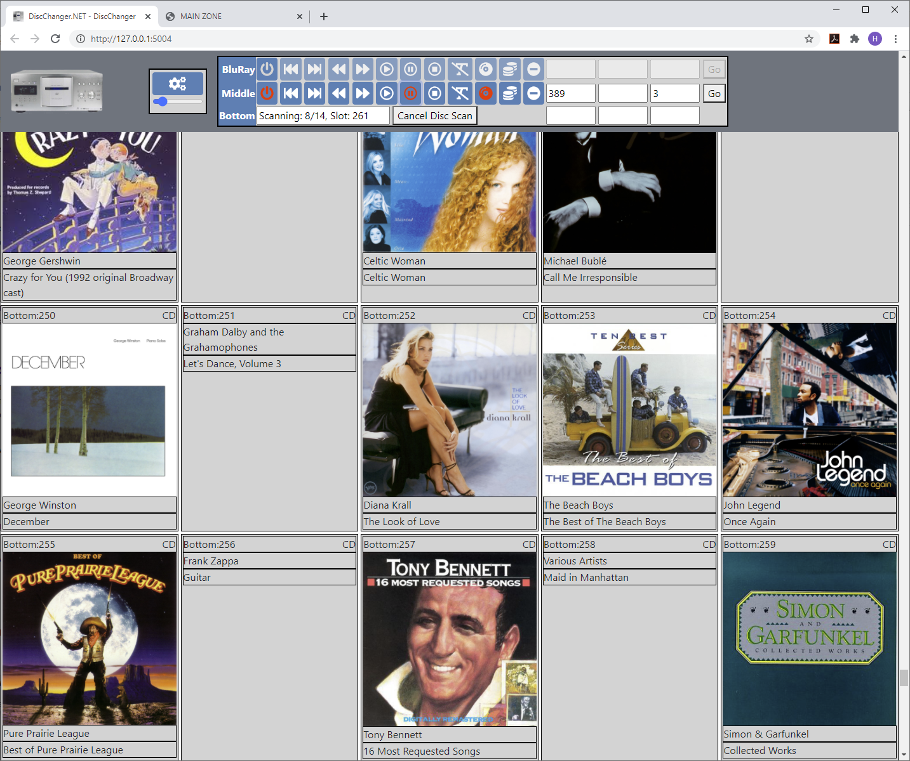

# DiscChanger.NET
ASP.NET Core Solution to manage discs in disc changers

Uses ASP.NET Core in .NET 9. Manages any number of disc changers. At the moment two types supported: DVP-CX777ES (RS-232 serial connection) and BDP-CX7000ES (TCP/IP or RS-232). Does disc data lookups via MusicBrainz (CD) and GD3 (<a href="https://www.getdigitaldata.com/GD3.aspx">GetDigitalData</a>, CD, DVD & Blu-Ray). Since ASP.NET Core is cross-platform, this works on Windows as well as Linux. 

I've tested it on a Raspberry Pi 4, which can control as many changers as it has serial ports. It has 5 real UARTs (#0, #2-#5) and a mini UART. Using the real UARTs (be sure to use proper 3.3V-RS232 adapters with or without hardware flow control CTS/RTS), one Raspberry Pi 4 could control 5 changers! <a href="https://www.raspberrypi.org/documentation/configuration/uart.md">Information on Raspberry Pi UARTs (serial ports)</a>.

And on Windows, it runs in IIS with the .NET 9 runtime (hosting bundle) installed, or from the command line using the dotnet command. MacOS is also supported by .NET 9.0. In IIS, I have had good results by setting 'Preload Enabled' to true in the DiscChanger.NET site Advanced Settings as well as 'Start Mode' to 'AlwaysRunning' in the DiscChanger.NET application pool's Advanced Settings.

You can scan all or a subset of the discs in the changer to populate the display. Also, when the changer loads a disc, it checks to see whether it is a known disc. If not, DiscChanger.NET will look it up and show it on the grid without reloading the page. By clicking on a music CD, you get a <a href="doc/DiscChanger.NET Popover audio tracks and links.png">popover</a> showing listing of tracks as well as web links known to the metadata providers pertaining to the disc.

To get started, go <a href="https://dotnet.microsoft.com/download/dotnet/7.0">here</a> to obtain the correct ASP.NET Core runtime for your OS. For the Raspberry Pi 4 running Raspian, I had to download the ARM32 version even though its CPU is 64 bit. Download DiscChanger.NET from the <a href="https://github.com/hugo-lyppens/DiscChanger.NET/releases">release list</a>

Then ensure you have serial ports working and null modem cables to connect to your disc changers. For PCs, I strongly recommend using any unused motherboard serial port headers (enable in BIOS & connect via Slot Plate adapter from 9-pin Serial to 10-pin mobo Header) before adding USB serial ports. My Supermicro board has two DTK serial port headers, which I've used for my cx777es changers, and my cx7000es is connected via a PL2303 USB serial port adapter.

Then ensure your changers are set up for RS232 control on their settings. Install the software and run via the dotnet command line. Navigate to the webpage and click the Add button to add your disc changer. Press the Test button to ensure the connection works and the changer responds to commands. Before running a wholesale disc scan just scan a few discs to ensure it all works well.

After you scanned all your discs, please be sure to make regular backups of the DiscChangers.json file and the Discs directory so you can restore it if needed without needing to rescan all discs.

Starting with version 1.0, DiscChanger.NET can source all metadata the BDP-CX7000ES can provide about discs. This includes (provided the CX7000ES successfully performed its GraceNote lookup): disc name/genre. For Audio CDs, individual track titles. For BD: AACS ID and for CD,DVD&BD a Gracenote ID. If anyone knows how to use these identifiers to find art or other metadata, please let me know. Also added a feature for DVP-CX777ES & Hybrid SACD: normally the player only provides the TOC, which enables MusicBrainz metadata lookup, when you force playback in CD mode via the "SACD/CD" button on the remote. In SACD mode, the album lookup fails and you see only the CD-TEXT. With this new feature, DiscChanger.NET remembers the TOC from the CD layer even when switching to the SACD layer. So what you can do is do a disc scan while in CD mode so the metadata lookups for hybrid SACDs succeed. Then, once you play back you can switch to SACD to enjoy the highest quality and the album art will remain.

Version 1.1: can connect to the BDP-CX7000ES via network connection as well as via serial port. You have to choose how in BDP-CX7000ES's System Settings/Custom Installation Control.  Only one connection mode is active at any given time. If you choose Network, it forces Quick Start Mode on, which increases the player's power usage when off. The advantage of serial control is the Quick Start Mode can remain off, lowering power usage in the off state. The advantage of network control is that the cabling is likely already in place, with no need to run a serial null modem cable from DiscChanger.NET host to the player. For network control, you either need to know the IP address of your player and fix it via DHCP reservation, or go to Network Settings/Internet Settings/IP Address Acquisition and set it to "Use Static IP Address". You can also use a host name if you have your local DNS set up to resolve a name to your BDP-CX7000ES. The default port number is 6001, a network port, which uses the same binary protocol (save for Sony's network-specific commands) as the serial port connection. I am aware that port 8888 provides the UPnP connection, which DiscChanger.NET does not use at this time. To find your player on your network, on Windows you can open Windows Explorer and find "BDP_CISIP" under Other Devices in Network. Right-click into Properties to see its current IP address. Again, if assigned via DHCP, this address is normally variable, so it is recommended to take action to fixate it.

Version 1.4 now supports lookups from a second metadata provider: <a href="https://www.getdigitaldata.com/GD3.aspx">GD3</a>. Requires account and purchase of lookup credits from their website. Supports CD, DVD and BD, with the disclaimer that according to a company representative, the DVD & BD service is no longer being updated & does not have the newest titles. It is important to understand that for DVD/BD, you can load free GD3 Matches (not counting against your account balance), often with low-resolution front cover thumbnail. The next step after loading matches is loading metadata, which does count against the CD and DVD lookups in your account but comes with much more detail and hi-res cover art. In the <a href="doc/GD3SettingsDialog.png">GD3 settings dialog</a>, you can enter your credentials and select whether metadata retrieval should be automatic for any new discs encountered by DiscChanger.NET. The default is no, as this goes against your available lookups. The free GD3 matches are retrieved for any new discs provided you have credentials configured. To get GD3 matches and metadata for your existing discs without rescanning, use the eye icon to open the <a href="doc/MetaDataRetrievalDialog.png">metadata retrieval dialog</a>. For GD3, loading free matches is a required first step. DiscChanger.NET can only read GD3 metadata for discs that have GD3 matches loaded. As an example, the combination of MusicBrainz and GD3 metadata and cover art retrieval has resulted in this <a href="doc/WideScreenDiscsCoverArt.png">nicely populated widescreen grid with relatively few blanks</a>.

Note that since version 1.4, DiscChanger.NET on Raspberry pi and other non-Windows OSs requires the libgdiplus  package (Raspian command: sudo apt install libgdiplus). If not, GD3 image retrieval will fail.

Version 1.5: upgrade to .NET 6

Version 1.6: upgrade to .NET 7. The serial port library of .NET 7 has a newly introduced bug causing it to throw IO exceptions instead of TimeOut exceptions as documented. Code contains workaround to treat IO exceptions caused by timeouts as timeouts.

Version 1.7: upgrade to .NET 8.

Version 1.8: upgrade to .NET 9 (not yet using any of its new features).

Future enhancements planned:
- Support for Firewire changers such as XL1B.

